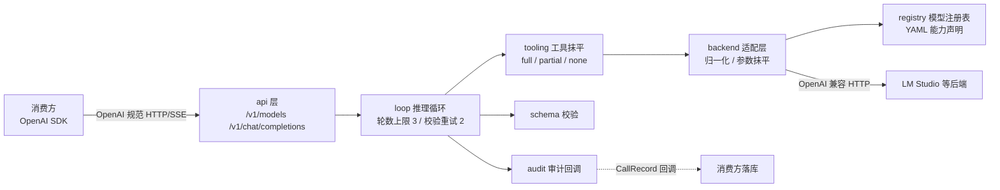
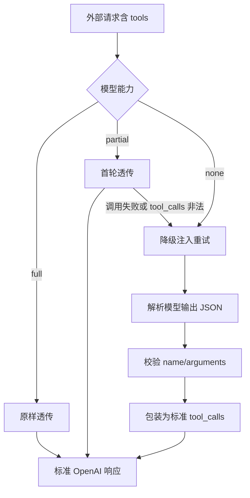

# qfy-agent 轻量级 AI Agent 网关库 - Plan

## Goal Capsule

- **目标:** 实现 qfy-agent Go 库：对外 OpenAI 兼容 HTTP API，对内以"能力声明 + 适配层"抹平本地模型差异，含受控推理循环与审计回调，通过全部验收标准。
- **权威层级:** 用户任务需求 > 本计划。需求文档即任务原文（第一版范围、技术约束、验收标准）。
- **停止条件:** 验收标准三项全满足（单元测试覆盖、真实联调三场景、交付物齐备）；工具轮数上限与校验重试等硬性约束达标。
- **执行画像:** 代码执行；7 个实现单元按依赖顺序推进，每单元独立提交。
- **尾部所有权:** 交付物完整（代码、配置示例、README、单元测试 + 联调验证结果说明）。

---

## Product Contract

### Summary

构建 qfy-agent：Go 编写的轻量级 AI Agent 网关库。对外暴露 OpenAI 兼容 HTTP API（模型列表、对话补全、SSE 流式），任何 OpenAI SDK 可直接接入。对内通过 YAML 模型注册表（能力声明）与适配层抹平本地模型在工具调用、JSON 模式、流式上的能力差异。内置受控推理循环（硬性轮数上限、输出校验失败自动重试）与审计回调钩子。附带最小可运行示例、配置示例、README、单元测试与真实联调验证。

### Problem Frame

公司财务系统需新增 AI 能力：导入非标准格式 Excel 时，由本地大模型识别列语义并映射到标准字段。模型部署在局域网 Mac mini（LM Studio，OpenAI 兼容端点 `http://192.168.1.91:1234/v1`）。主力模型 google/gemma-4-e4b（4B）原生工具调用能力薄弱，gemma-4-12b 部分可用。直接对接会迫使业务代码适配不同模型的能力差异；引入重型 agent 框架又与"轻量、可控、可审计"的诉求冲突。因此自研薄网关：对外协议固定为 OpenAI 规范，对内按模型能力声明自动选择适配策略。

### Requirements

**OpenAI 兼容 API 入口**

- R1. 提供 `GET /v1/models`，按 OpenAI 规范返回注册表中的模型列表。
- R2. 提供 `POST /v1/chat/completions`，支持 messages、temperature、max_tokens、tools、tool_choice、response_format（json_object）、stream 参数。
- R3. 请求与响应严格遵循 OpenAI 规范：非流式响应骨架、SSE chunk 与 tool_calls delta 结构、`data: [DONE]` 结尾、标准 error 事件与错误体格式。

**模型能力声明与适配层**

- R4. 模型注册表由 YAML 声明：backend、base_url、api_key、model id、capabilities（tool_calling: full|partial|none、json_mode、streaming）、default_params。
- R5. 适配层执行请求归一化、响应归一化、参数抹平（外部未传参数用注册表 default_params 填充）。
- R6. 新增模型只改配置不改代码，注册表驱动全部行为。

**工具调用抹平**

- R7. tool_calling=full：tools 字段原样透传后端，tool_calls 原样返回。
- R8. tool_calling=partial：首轮原生透传，失败一次后自动降级为注入策略。
- R9. tool_calling=none：适配层把 tools 描述改写为 prompt 注入，模型输出 JSON 由适配层解析、校验，再包装为标准 OpenAI tool_calls 结构。
- R10. 消费方看到的永远是标准 tool_calls 结构，无感知后端真实能力。

**SSE 流式**

- R11. 后端 streaming=true 时透传/转发真实 SSE 流。
- R12. 后端 streaming=false 时缓冲完整响应，按 SSE 格式模拟流式逐段吐出。
- R13. SSE 实现要点齐备：标准 data 行格式、`data: [DONE]`、心跳注释行、http.Flusher 立即 flush、流中错误发标准 error 事件、流式读超时单独放宽。

**受控推理循环**

- R14. 工具调用循环有硬性轮数上限，默认 3 轮。
- R15. 模型输出做 schema 校验，校验失败自动重试（最多 2 次），仍失败返回稳定错误，不让模型自由输出。
- R16. 已注册执行器的工具由网关内循环自动执行；未注册执行器的工具返回标准 tool_calls 由消费方执行后回传。

**审计与配置**

- R17. 提供 OnCall 审计钩子，每次调用（含流式）回传记录：模型、输入摘要、输出、采用的策略、耗时、错误；库不碰数据库。
- R18. 库不读取环境变量，配置通过参数/配置文件注入，由消费方负责加载。

### Key Decisions

- KD1. 对外协议固定为 OpenAI 兼容规范，消费方（任何 OpenAI SDK）无感知。Governs R1, R2, R3, R10。
- KD2. 内部用"模型能力声明 + 适配层"抹平差异，新增模型不改代码。Governs R4, R5, R6。
- KD3. 受控优先：轮数上限、校验重试、稳定错误，绝不让模型自由输出。Governs R14, R15。
- KD4. 可审计：输入摘要、输出、策略、耗时、错误经回调交给消费方落库，库本身不碰数据库。Governs R17。

### Success Criteria

- 验收标准 1：单元测试覆盖请求归一化、响应归一化、工具调用三种策略、SSE 模拟流式、schema 校验重试。
- 验收标准 2：真实联调（LM Studio `http://192.168.1.91:1234/v1`，gemma-4-e4b）验证普通 chat、tools 注入返回标准 tool_calls、stream=true 返回标准 SSE 流。
- 验收标准 3：交付最小可运行示例（配置文件 + 启动服务 + curl 验证命令）、README、单元测试与联调验证结果说明。
- 环境事实：本地 Go 1.26.1；端点已确认可达，`/v1/models` 返回 gemma-4-e4b、gemma-4-12b、text-embedding-nomic-embed-text-v1.5 等。

### Scope Boundaries

**Deferred to Follow-Up Work（二期）**

- `/v1/embeddings`（配合 nomic-embed 做已确认映射的向量检索记忆）。
- MCP 桥接（生态插件形态）。
- 多后端协议（Anthropic/Gemini 原生协议）。
- response_format 的 json_schema（strict）完整支持，第一版仅 json_object。

**Outside this product's identity**

- 鉴权、限流、多租户（消费方网关层职责，不在库内）。
- 审计记录持久化（回调交给消费方落库）。
- 数据库、向量检索等任何存储能力。

---

## Planning Contract

### Key Technical Decisions

- KTD1. **对外 HTTP 入口使用标准库 net/http，不用 Gin**（session-settled: user-directed — chosen over Gin: 用户在范围确认中选定；零依赖符合"最薄封装"定位，Go 1.22+ ServeMux 支持方法与路径参数，SSE 所需 Flusher/ResponseController 为标准库原生能力，且库形态不绑定消费方框架）。
- KTD2. **Go module 路径为 github.com/qfy-agent/qfy-agent**（session-settled: user-directed — chosen over 其他占位: 用户在范围确认中选定；纯占位，可全局替换）。
- KTD3. **工具执行双模式**：消费方通过注册表为工具注册执行函数时，网关在单次请求内自动执行受控循环（模型调用 → 工具执行 → tool 消息回填 → 再调用，直到无 tool_calls 或达到 R14 轮数上限）；只定义未注册执行器的工具时，响应返回标准 tool_calls 由消费方执行并回传（标准 OpenAI 多轮形态，满足 R10 与验收"返回标准 tool_calls"）。选择理由：兼顾"网关内可控循环"与"消费方自主编排"两种真实用法，对外协议形态不变。**混合场景语义**：一次响应中存在任一未注册执行器的 tool_call 时，整轮返回标准 tool_calls，不部分执行——保持消费方可预测。
- KTD4. **注入策略的 prompt 模板与解析健壮性**：系统消息注入工具列表（JSON Schema 文本，高频工具在前、精简 schema）加约束"只输出单个 JSON 对象 {"name": "...", "arguments": {...}}，不要 markdown、不要解释"，附 1-2 个 few-shot 示例。解析按序降级：直接 json.Unmarshal → 剥离代码围栏与前后散文 → 括号配对扫描提取首个完整 JSON 对象；arguments 用 json.RawMessage 延迟解析。依据外部研究：小模型 JSON 不稳定是已知问题，解析降级链与 JSON mode 提示是业界共识做法。
- KTD5. **partial 降级判定**：首轮原生透传，触发降级的条件为后端调用失败（HTTP 非 2xx、网络错误、超时）或响应中 tool_calls 结构无法解析（缺 id/name/arguments 或 arguments 非 JSON）；触发后本轮以注入策略（KTD4）重试一次。模型合理选择不调用工具不算失败。
- KTD6. **内置轻量 JSON schema 校验器，不引入第三方校验库**：支持 type、properties、required、enum、items 子集，输出结构化错误列表（字段路径 + 错误类型码）；用于注入输出校验（name ∈ 工具集、arguments 结构）与 JSON mode 输出校验。校验失败把错误回喂模型重试，最多 2 次（R15），仍失败返回稳定错误（统一错误体，不外泄原始堆栈）。重试判定基于错误类型码，不做错误消息字符串匹配。
- KTD7. **SSE 工程细节**：心跳注释行 `: keep-alive` 间隔 15s（小于常见代理 idle 超时 60s，留 2 倍余量）；每次写出前用 http.NewResponseController(w).SetWriteDeadline 续期（默认 30s），规避 WriteTimeout 截断流；上游透传用 bufio.Reader 逐事件读改写并立即 Flush，先读上游状态码（非 2xx 直接返回错误体不伪流式），客户端断开经 context 取消上游请求；模拟流按小块切分 content 增量、首 chunk 带 role、末 chunk 带 finish_reason、`data: [DONE]` 结尾；流中错误发标准 error 事件；上游流缺 `[DONE]` 视为截断并在审计中记录。
- KTD8. **协议兼容白名单**：响应 object 常量（chat.completion / chat.completion.chunk）、finish_reason 仅输出规范枚举（stop|length|tool_calls|content_filter）、错误体统一为 {"error":{message,type,param,code}}、max_tokens 与 max_completion_tokens 双字段兼容透传、stream_options.include_usage 支持（usage chunk 以空 choices 数组发出，随后 [DONE]）。依据外部研究：官方 openai-openapi 规范已逐字段核对。未知请求字段显式透传后端，未知响应字段显式丢弃——白名单语义双向明确。
- KTD9. **错误分类与审计归属**：typed error taxonomy 定义于 backend 层（后端不可用、响应畸形、超时等可识别错误类型），tooling 只做策略决策，不解析错误消息文本；CallRecord 按路径归属——非流式由 loop 层产出，流式透传由 api 层在流结束/中断时产出（评审修正 G2，实现已按此落地），模拟流复用 loop 产出；审计回调以 recover 包裹，回调 panic 不影响请求响应。

### High-Level Technical Design



工具调用三策略的适配流程：



### Sources & Research

外部研究为 load-bearing（协议细节塑造 KTD7、KTD8 与 U6 测试场景），权威来源：

- 官方 OpenAPI 规范（主依据，逐 schema 核对）：https://github.com/openai/openai-openapi
- Chat Completions 请求字段参考：https://platform.openai.com/docs/api-reference/chat/create
- 响应对象定义：https://platform.openai.com/docs/api-reference/chat/object
- 流式 chunk 与 SSE 说明：https://platform.openai.com/docs/api-reference/chat/streaming
- 流式处理指南（delta 拼接、usage chunk）：https://platform.openai.com/docs/guides/streaming-responses
- 函数调用指南（工具定义、tool_choice、多轮 loop）：https://platform.openai.com/docs/guides/function-calling
- 错误对象与错误码：https://platform.openai.com/docs/guides/error-codes
- 官方多轮函数调用示例：https://cookbook.openai.com/examples/how_to_call_functions_with_chat_models
- LiteLLM 兼容网关行为交叉印证：https://docs.litellm.ai/docs/completion/usage
- Go ResponseController（写超时续期）：https://pkg.go.dev/net/http#ResponseController
- SSE 服务端参考实现：https://github.com/replicate/sse/blob/master/http.go
- 心跳必要性（代理 idle 超时）：https://github.com/vllm-project/vllm/issues/47647
- 无原生工具调用模型的注入实现参考：https://github.com/OpenHands/software-agent-sdk/blob/main/openhands-sdk/openhands/sdk/llm/mixins/non_native_fc.py
- 流式 SSE 代理工程实践：https://dev.to/gauravdagde/streaming-sse-proxying-for-llm-apis-the-hard-parts-4d60

### Assumptions

- LM Studio 后端可用且响应基本符合 OpenAI 规范（端点可达性已确认；字段差异由 U2 响应归一化容错）。
- gemma-4-e4b 无可靠原生工具调用（用户提供），以注入策略（KTD4）为主路径。
- 消费方负责注册工具执行函数与审计落库逻辑；库只提供机制。
- 注入模板的精确措辞、模拟流分块粒度、心跳间隔等参数在联调时调优，属实施期细节。

### System-Wide Impact

- **对外契约固定**：对外 HTTP 契约是长期兼容承诺，任何字段变化需经白名单语义（KTD8）显式决策，消费方 SDK 无感知。
- **审计执行模型**（F1）：OnCall 在请求 goroutine 内同步触发；流式调用在流结束后或流中断后触发；并发请求下回调被并发调用，消费方落库逻辑须自保证并发安全（README 写明契约）。
- **工具执行边界**（F2）：工具执行函数在消费方进程内运行，模型受控参数直接驱动消费方代码——信任边界在消费方；单工具执行须有超时上限（per-tool timeout），执行函数 panic 由库 recover 转为 tool 错误消息回填，不中断请求。
- **请求延迟上界与超时预算**（F3）：嵌套重试最坏单请求 12 次上游调用（最多 3 轮 × 每轮最多 4 次：1 次原生 + 1 次降级 + 首次注入 + 最多 2 次校验重试）；提供单请求上游调用总次数上限配置项（默认 12）兜底，README 按消费方部署拓扑（代理/LB 超时）给出建议值。
- **流中断失败传播路径**（F4）：客户端断连 → context 取消上游 → 终止写出 → 以部分记录触发审计；上游截断（缺 [DONE]）→ 发标准 error 事件 → 审计标记 truncated。错误事件与 [DONE] 的顺序语义在实现中闭合。
- **并发模型**（F5）：注册表加载后不可变（default_params 合并采用只读拷贝）；工具执行器表以同步原语保护；并发正确性纳入 race 检查范围。
- **协议与后端版本基线**（F6）：README 记录后端（LM Studio）版本、联调日期与 golden 基线；协议漂移以 openai-openapi 规范版本 pin 为参照。

### Risks & Dependencies

| 风险 | 影响 | 缓解 |
|---|---|---|
| LM Studio 响应字段与官方规范有差异 | 消费方 SDK 解析失败 | U2 响应归一化容错补齐；联调验证实际差异 |
| e4b 注入输出 JSON 不稳定 | 工具调用失败率上升 | KTD4 解析降级链 + KTD6 校验重试 + 稳定错误兜底 |
| 上游流缺 `[DONE]` 或异常中断 | 消费方视为截断错误 | 透传层记录截断事件，审计留痕，错误事件上抛 |
| 消费方 http.Server 配置 WriteTimeout | 长流被截断 | KTD7 写前续期 + README 明确 server 配置建议 |
| 依赖仅 gopkg.in/yaml.v3 | 唯一第三方（非 LLM/agent 框架） | 明确为刻意选择，注册表结构独立于解析库 |
| 审计回调 panic 或耗时过长 | 请求响应受影响、连接占用延长 | KTD9 recover 包裹；README 写明回调契约（不得 panic、落库须异步化） |
| 工具执行挂起或 panic | 请求 goroutine 与 SSE 连接被无限占用 | per-tool timeout 配置项；panic 转为 tool 错误消息回填（F2） |
| 嵌套重试延迟放大 | 慢请求概率显著上升，代理 read timeout 截断 | 单请求上游调用总次数上限配置（F3） |
| 协议与后端双漂移（OpenAI 规范演进、LM Studio 升级） | 归一化层失效、SDK 兼容破坏 | KTD8 白名单双向语义；联调捕获真实响应固化为 golden 测试；README 记录后端版本（F6） |
| 并发安全缺陷（注册表、工具执行器表、审计） | 数据竞争、行为不确定 | 注册表不可变 + 同步原语 + race 检查覆盖全部包（F5） |

---

## Implementation Units

### U1. 项目骨架与模型注册表

- **Goal:** 建立 Go 模块骨架与 YAML 驱动的模型注册表（能力声明 + 默认参数）。
- **Requirements:** R4, R6。
- **Dependencies:** 无。
- **Files:**
  - `go.mod`（module github.com/qfy-agent/qfy-agent，依赖 gopkg.in/yaml.v3）
  - `registry/model.go`（Model、Capabilities、DefaultParams 结构，能力枚举校验）
  - `registry/registry.go`（YAML 加载、Get/List、参数合并）
  - `registry/registry_test.go`
  - `config/models.example.yaml`（注册表配置示例，含 gemma-4-e4b 与 gemma-4-12b 两条）
- **Approach:**
  1. 定义模型声明结构：ID、Backend、BaseURL、APIKey、Model（后端模型 id）、Capabilities{ToolCalling, JSONMode, Streaming}、DefaultParams{Temperature, MaxTokens, 其他透传参数}。
  2. 注册表从 YAML 字节加载（消费方读取文件后传入，库不碰文件系统与环境变量，对齐 R18）。
  3. 校验能力枚举合法性（full|partial|none）与必填字段（base_url、model id）。
  4. Get 未知名返回明确错误；List 返回全部模型（供 /v1/models）。
  5. 配置示例声明两条模型：gemma-4-e4b（tool_calling: none、json_mode: true、streaming: true）、gemma-4-12b（tool_calling: partial、json_mode: true、streaming: true）。
- **Test scenarios:**
  - 合法 YAML 加载出完整模型声明（能力枚举、default_params 正确解析）。
  - 非法能力枚举值（如 "sometimes"）报错。
  - 缺失必填字段（base_url、model id）报错。
  - Get 不存在的模型返回明确错误。
  - default_params 缺省字段有内置默认值兜底。
- **Verification:** `go test ./registry/` 通过；`go build ./...` 通过。

### U2. 后端适配层

- **Goal:** OpenAI 兼容后端 HTTP 客户端与请求/响应归一化、参数抹平。
- **Requirements:** R2, R5, R11（流式透传的基础）。
- **Dependencies:** U1。
- **Files:**
  - `backend/client.go`（HTTP 客户端、超时配置、流式与非流式调用入口）
  - `backend/normalize.go`（请求归一化、响应归一化、参数抹平、错误体规范化）
  - `backend/client_test.go`、`backend/normalize_test.go`
- **Approach:**
  1. 请求归一化：外部 OpenAI 格式请求 + 注册表 default_params 合并为后端请求；max_tokens 与 max_completion_tokens 双字段兼容透传；tools/tool_choice/response_format/stream 原样透传。
  2. 响应归一化：补齐缺失字段（id、created、usage）；finish_reason 白名单化（非规范枚举按 KTD8 处理）；错误体统一为 {"error":{message,type,param,code}}。
  3. 非流式调用：JSON 编解码，非 2xx 解析错误体，网络错误/超时包装为可识别错误类型（供 U3 降级判定）。
  4. 流式调用：返回上游响应体给上层逐事件读取；请求携带 context 以便客户端断开时取消上游。
  5. API key 注入 Authorization: Bearer，配置缺省时为空。
- **Test scenarios:**
  - 参数抹平：外部未传 temperature 时填入 default_params 值。
  - 请求正确性：httptest 后端断言收到的 headers（Authorization）与 JSON 字段。
  - 响应归一化：后端缺 id/created/usage 时补齐为合法骨架。
  - finish_reason 未知值按白名单处理。
  - 后端非 2xx 返回规范化错误体。
  - 网络错误/超时返回可识别错误（标记可降级）。
- **Verification:** `go test ./backend/` 通过。

### U3. 工具调用抹平

- **Goal:** 按模型能力选择 full/partial/none 策略，消费方只见标准 tool_calls。
- **Requirements:** R7, R8, R9, R10。
- **Dependencies:** U2。
- **Files:**
  - `tooling/tooling.go`（策略选择入口、partial 降级判定）
  - `tooling/inject.go`（注入 prompt 模板、few-shot）
  - `tooling/parse.go`（解析降级链：直接解析、剥围栏、括号配对提取）
  - `tooling/tooling_test.go`
- **Approach:**
  1. full：tools 原样透传（U2），响应 tool_calls 经归一化返回。
  2. partial：首轮透传；按 KTD5 触发降级时本轮以注入策略重试一次。
  3. none：构造注入 system 消息（KTD4 模板）→ 调用后端 → 解析降级链提取 JSON → 校验 name ∈ 工具集、arguments 为合法 JSON → 包装为标准 tool_calls（生成 id、type:"function"、function.arguments 重序列化）。
  4. 同时兼容后端偶发输出原生 tool_calls 字段（直接识别透传）。
- **Test scenarios:**
  - full 策略：请求含 tools，响应 tool_calls 原样返回。
  - none 策略：注入 system 消息出现在请求中（含工具列表与 JSON 约束）。
  - none 策略：模型输出 {"name","arguments"} → 包装为标准 tool_calls（id/type/function.name/function.arguments 合法 JSON 字符串）。
  - none 策略：模型输出带 ```json 围栏 → 解析成功。
  - none 策略：模型输出带前后散文 → 括号配对提取成功。
  - none 策略：模型输出非法 JSON 且无法提取 → 明确错误。
  - none 策略：模型输出未知工具名 → 校验失败错误。
  - partial 策略：首轮成功 → 无降级。
  - partial 策略：首轮后端 500 → 降级注入重试。
  - partial 策略：首轮 tool_calls 结构非法 → 降级注入重试。
  - partial 策略：降级后仍失败 → 错误上抛。
- **Verification:** `go test ./tooling/` 通过。

### U4. schema 校验

- **Goal:** 内置轻量 JSON schema 校验器，供输出校验与重试编排使用。
- **Requirements:** R15（校验能力）。
- **Dependencies:** 无（独立包，被 U5 使用）。
- **Files:**
  - `schema/schema.go`（校验器：type/properties/required/enum/items 子集）
  - `schema/schema_test.go`
- **Approach:**
  1. 校验器接收 JSON 文档（bytes）与 schema（map），输出结构化错误列表（含字段路径）。
  2. 支持子集：对象 type、properties、required、enum、items、string/number/integer/boolean/array/object。
  3. 空 schema（{}）只校验合法 JSON 与根类型。
  4. 供两处使用：注入输出校验（{name, arguments} 结构）与 JSON mode 输出校验（合法 JSON 对象）。
  5. 不引入第三方校验库（KTD6）。
- **Test scenarios:**
  - 合法对象通过。
  - 必填缺失报错并含字段名。
  - 类型不匹配报错（string 传 number 等）。
  - enum 不匹配报错。
  - 嵌套对象与数组校验。
  - 非法 JSON 输入报错。
  - 空 schema 行为（合法 JSON 即通过）。
- **Verification:** `go test ./schema/` 通过。

### U5. 推理循环与审计

- **Goal:** 受控工具调用循环（轮数上限、校验重试、工具执行编排）与审计回调。
- **Requirements:** R14, R15, R16, R17。
- **Dependencies:** U2, U3, U4。
- **Files:**
  - `loop/loop.go`（循环编排：模型调用 → tool_calls → 执行 → tool 消息回填 → 再调用）
  - `loop/retry.go`（校验失败重试编排，最多 2 次）
  - `loop/loop_test.go`
  - `audit/audit.go`（CallRecord、OnCall 钩子）
  - `audit/audit_test.go`
- **Approach:**
  1. 循环入口：注册表取模型能力 → 按 U3 策略构造请求 → 调用 → 无 tool_calls 或达到轮数上限（默认 3）返回最终响应。
  2. 有 tool_calls 且工具已注册执行函数：执行（消费方函数，per-tool timeout 配置）→ 结果以 role=tool + tool_call_id 消息回填 → 再调用；执行函数 panic 由库 recover 转为 tool 错误消息回填（F2）。
  3. 有 tool_calls 但未注册执行函数：立即返回标准响应（含 tool_calls），消费方执行后以标准 OpenAI 多轮继续（KTD3 混合场景语义）。
  4. 输出校验失败：把校验错误作为消息回喂 → 重试（最多 2 次）→ 仍失败返回稳定错误（KTD6）。
  5. 审计：每次后端调用生成 CallRecord（时间戳、模型、策略、输入摘要、输出摘要、耗时、错误、轮次、是否流式）；CallRecord 统一由 loop 产出，api/流式层只中继（KTD9）；OnCall 为可配置回调（recover 包裹），流式调用在流结束后触发，流中断以部分记录触发（F4）。
  6. 输入摘要：消息数、各角色 content 前 N 字符、工具列表、轮次。
  7. 单请求上游调用总次数上限配置项（默认 12：最多 3 轮 × 每轮最多 4 次——1 次原生 + 1 次降级 + 首次注入 + 最多 2 次校验重试），超限返回稳定错误（F3）。
- **Test scenarios:**
  - 单轮无工具调用直接返回。
  - 工具调用 → 执行 → 回填 → 模型给出最终答案（两轮完成）。
  - 达到轮数上限（3 轮）停止并返回。
  - 工具执行返回错误 → 错误作为 tool 消息回填。
  - 工具执行 panic → 转为 tool 错误消息回填，请求不中断（F2）。
  - 工具执行超时（per-tool timeout 触发）→ 超时错误回填。
  - 未注册执行器的工具 → 响应含标准 tool_calls；混合场景（部分注册）→ 整轮返回标准 tool_calls（KTD3）。
  - 校验失败 1 次后成功（重试生效）。
  - 校验连续失败 3 次（含首次）→ 稳定错误。
  - 单请求上游调用次数超限 → 稳定错误。
  - 审计回调收到完整 CallRecord（含耗时、策略、错误字段）；回调 panic 不影响请求。
- **Verification:** `go test ./loop/ ./audit/` 通过。

### U6. SSE 流式

- **Goal:** 透传真实流与模拟流式，格式严格符合 OpenAI chunk 规范。
- **Requirements:** R11, R12, R13。
- **Dependencies:** U2。
- **Files:**
  - `api/sse.go`（SSE 写出、心跳、错误事件、写超时续期）
  - `api/stream_proxy.go`（上游流透传）
  - `api/stream_simulate.go`（缓冲模拟流）
  - `api/sse_test.go`
- **Approach:**
  1. 透传（R11）：先读上游状态码，非 2xx 直接返回错误体；bufio.Reader 逐事件读取 → 原样写出并 Flush；客户端断开经 context 取消上游请求（KTD7）。
  2. 模拟流（R12）：非流式完整响应 → 按块切分 content（首 chunk 带 role，增量逐块发出）→ 末 chunk 带 finish_reason → `data: [DONE]`；tool_calls 按 index 组织 delta（首 chunk 带 id/name，后续仅 arguments 增量）。
  3. 心跳：15s 间隔发 `: keep-alive` 注释行（长任务、工具执行期间）。
  4. 写超时：每次写出前 SetWriteDeadline 续期（默认 30s）。
  5. 错误：流中错误发标准 error 事件；上游缺 [DONE] 视为截断，审计记录。
  6. include_usage：按 KTD8 发 usage chunk（空 choices）后 [DONE]。
- **Test scenarios:**
  - 透传：模拟上游流 → 客户端收到逐事件 data 行与 [DONE]。
  - 透传：上游非 2xx → 返回错误体（不伪流式）。
  - 透传：客户端断开 → 上游请求取消（httptest 验证）。
  - 模拟流：内容增量分块、首 chunk 带 role、末 chunk finish_reason、[DONE]。
  - 模拟流：tool_calls delta 按 index 增量（id/name 仅首块）。
  - 心跳：配置短间隔验证注释行发出。
  - 错误事件格式符合规范。
  - include_usage：usage chunk（choices 为空）后 [DONE]。
- **Verification:** `go test ./api/` 通过。

### U7. HTTP API 服务与交付物

- **Goal:** 两个 API 端点、示例服务、交付级配置示例、README 与真实联调验证。
- **Requirements:** R1, R2, R3, R18（及全部验收标准）。
- **Dependencies:** U5, U6。
- **Files:**
  - `api/server.go`（net/http ServeMux 路由、两个端点、错误处理）
  - `api/models.go`、`api/chat.go`（端点处理器）
  - `api/server_test.go`（httptest 端到端）
  - `cmd/qfy-agent-server/main.go`（可运行示例：加载配置、注册表、审计打印、启动服务）
  - `config/models.example.yaml`（交付级示例，含 gemma-4-e4b / gemma-4-12b 两条）
  - `README.md`（架构说明、配置说明、curl 验证示例、联调验证结果）
- **Approach:**
  1. 路由：GET /v1/models、POST /v1/chat/completions；未知路由与错误返回 OpenAI 风格错误体。
  2. 请求解析与校验：messages 必填、model 必须存在于注册表、tools 结构校验，失败返回规范错误体（400）。
  3. 非流式：loop 结果按标准响应骨架输出；流式：走 U6。
  4. 库不读文件与环境变量：server 由消费方组装（配置字节 → 注册表 → 库实例），示例 main 演示完整组装。
  5. 示例服务监听 127.0.0.1:8080，审计记录打印 stdout。
  6. README 含 curl 验证示例（普通 chat、带 tools、stream=true 三条命令）。
  7. 联调：对 `http://192.168.1.91:1234/v1` 的 gemma-4-e4b 验证三场景，结果记录进 README。
- **Test scenarios:**
  - GET /v1/models 返回标准 list 结构。
  - POST chat 非流式返回标准响应骨架（id/object/choices/usage）。
  - POST chat 未知模型 → 规范错误体。
  - POST chat 缺 messages → 400 规范错误体。
  - POST chat stream=true → SSE 流（增量 + [DONE]）。
  - POST chat 带 tools（none 能力模型）→ 标准 tool_calls。
  - POST chat response_format json_object → 输出为合法 JSON。
  - 端到端：单请求内注入策略完成，审计记录含策略字段。
- **Verification:** `go test ./...` 全绿；`go vet ./...` 通过；示例服务启动后 curl 三场景通过；联调结果写入 README。

---

## Verification Contract

| 门禁 | 命令/动作 | 适用 |
|---|---|---|
| 单元测试 | `go test ./...` | 全部单元（U1-U7 的测试场景） |
| 静态检查 | `go vet ./...` | 全部单元 |
| 竞态检查 | `go test -race ./...` | 全部包（registry、backend、tooling、schema、loop、audit、api） |
| 端到端 | `go test ./api/ -run TestE2E` | U7 httptest 端到端 |
| 真实联调 | 启动示例服务，对 `http://192.168.1.91:1234/v1`（gemma-4-e4b）执行三场景 curl | U7 交付验证 |

真实联调三场景（验收标准 2）：

1. 普通 chat 请求返回标准响应骨架。
2. 带 tools 的请求走注入策略，返回标准 tool_calls（含 id、type、function.name、function.arguments）。
3. stream=true 请求返回标准 SSE 流（data 行、增量 delta、`data: [DONE]`）。

---

## Definition of Done

**全局（计划完成即全部满足）**

- 验收标准三项全部满足（单元测试覆盖、真实联调三场景、交付物齐备）。
- 零第三方 LLM/agent 框架依赖；依赖仅 gopkg.in/yaml.v3。
- 代码分层清晰：registry / backend / tooling / schema / loop / audit / api。
- README 完整：架构说明、配置说明、curl 验证示例、联调验证结果。
- 工具轮数上限（默认 3）与校验重试（最多 2 次）为硬性默认值并配置化。

**清理准则**

- 无死代码、无实验性残留、无未使用配置字段。
- 联调中发现的与规范差异（如有）记录进 README，不留隐形假设。

**逐单元（各单元 Verification 列出的结果全部达成）**
